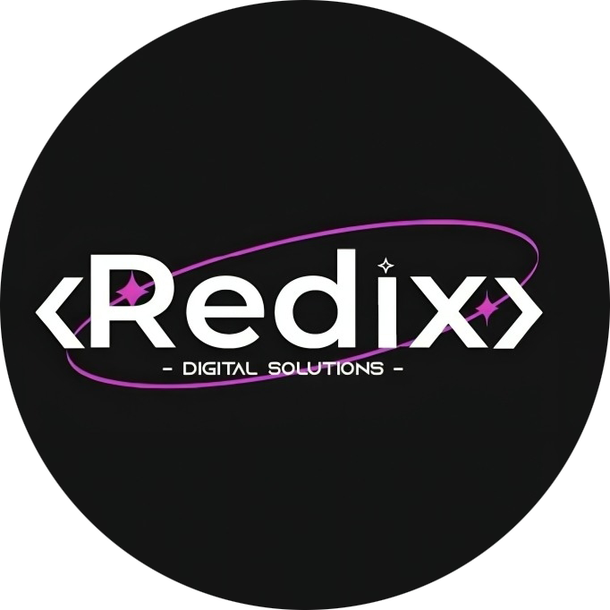

# 🏠 Redix Digital Solutions - Furniture Portfolio

> Transforming furniture businesses through premium video content, photography, and digital marketing excellence.

## 🎯 About

A premium portfolio website showcasing Redix Digital Solutions' work in furniture video content creation, professional photography, and web development for home furnishing businesses.

Based in Tunisia, we serve clients worldwide with cutting-edge digital marketing solutions, specializing in:
- Furniture Video Production
- Professional Product Photography
- E-commerce Website Development
- Interior Design Content Creation

## ✨ Features

- 🎥 **Interactive Video Gallery** - Custom video player with controls (play/pause, volume, speed, fullscreen)
- 📸 **Image Gallery with Lightbox** - Professional photo showcase with modal viewer
- 🔍 **Advanced Filtering** - Filter by client and category for both videos and images
- 📱 **Fully Responsive** - Optimized for all devices and screen sizes
- 🎨 **Premium Design** - Gradient backgrounds with purple/blue theme
- 🚀 **Fast Performance** - Built with Vite for lightning-fast load times
- 🌐 **Web Projects Showcase** - Display of developed e-commerce platforms

## 🛠️ Tech Stack

### Frontend
- **React 19.1.1** - UI library
- **Vite 7.1.7** - Build tool and dev server
- **CSS Modules** - Scoped styling
- **Lucide React** - Icon library
- **React Icons** - Additional icons

### Features
- Native HTML5 video player with custom controls
- Image lightbox with smooth animations
- Intersection Observer for lazy loading
- Responsive aspect ratio handling

## 🚀 Getting Started

### Prerequisites
- Node.js 18+ installed
- npm or yarn package manager
- Git

### Installation

1. **Clone the repository**
git clone https://github.com/RedixDigitalSolutions/travel-agency.git

cd travel-agency-portfolio

2. **Install dependencies**
npm install

3. **Add your assets**
- Place videos in `public/assets/video/`
- Place images in `public/assets/photos/`
- Update `src/data/data.js` with your content

4. **Start development server**
npm run dev

5. **Open your browser**
- Navigate to `http://localhost:5173`

### Build for Production

npm run build

### Preview Production Build

npm run preview

## 📁 Project Structure

travel-agency-portfolio/
├── public/
│ ├── assets/
│ │ ├── photos/ # Product photos
│ │ └── video/ # Video content
│ └── redix_logo.png # Company logo
├── src/
│ ├── components/
│ │ ├── Navbar.jsx
│ │ ├── Hero.jsx
│ │ ├── VideoCard.jsx
│ │ ├── VideoGallery.jsx
│ │ ├── ImageGallery.jsx
│ │ ├── WebsiteShowcase.jsx
│ │ └── Footer.jsx
│ ├── data/
│ │ ├── data.js # Videos and images data
│ │ └── links.js # Website portfolio data
│ ├── App.jsx
│ ├── index.css
│ └── main.jsx
├── package.json
├── vite.config.js
└── README.md

## 🌐 Deployment

### Deploy to GitHub Pages

npm run deploy

Your site will be live at: `https://redixdigitalsolutions.github.io/travel-agency/`

## 👥 Our Clients

### Furniture Video Content
- **Modern Living** - Contemporary furniture showcase
- **Comfort Home** - Cozy home furnishings
- **Elegant Interiors** - Premium interior design
- **Cozy Corner** - Comfortable living solutions
- **Urban Style** - Modern urban furniture
- **Premium Furnish** - Luxury furniture pieces
- **Home Essence** - Essential home furniture
- **Luxury Living** - High-end furniture collections

## 📞 Contact

**Redix Digital Solutions**

- 🌐 Website: [redixsolutions.pro](https://redixsolutions.pro/)
- 📧 Email: contact@redixsolutions.pro
- 📱 Phone: (+216) 21-999-898
- 📍 Location: Smart Technopark Manouba, Tunisia

### Social Media
- [Instagram](https://www.instagram.com/redixdigitalsolutions/)
- [Facebook](https://www.facebook.com/profile.php?id=61560535962106)
- [LinkedIn](https://www.linkedin.com/company/redix-digital-solutions/posts/?feedView=all)
- [WhatsApp](https://wa.me/21692861655)

## 📄 License

Copyright © 2025 Redix Digital Solutions. All rights reserved.

---

**Built with ❤️ by Redix Digital Solutions**

*Transforming businesses through innovative digital solutions*